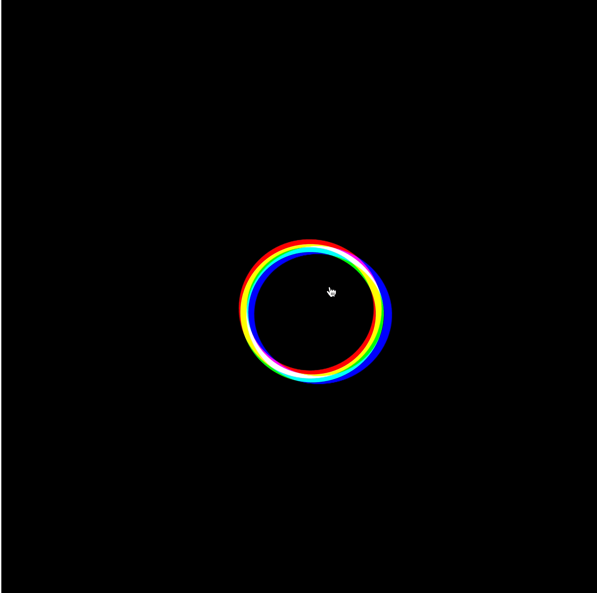

## This is Erin and Jocob's Github page for our first project. 

### Project Overview

For our first Github project, we used an example from P5 and was inspired by the Springs category. We used Alex Waz as an inspiration to our project and created a simple pull and tug circle that reveals other colors and disforms the shape. 

### Code GIF

